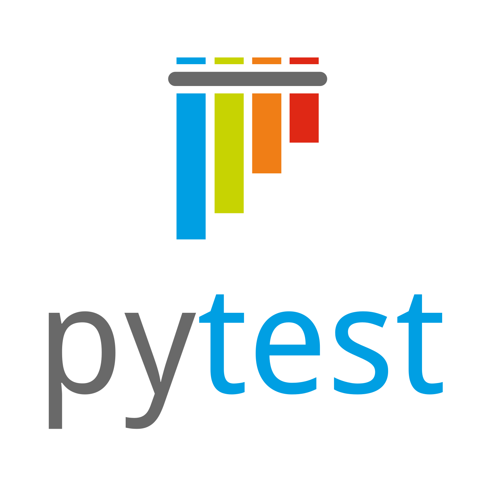
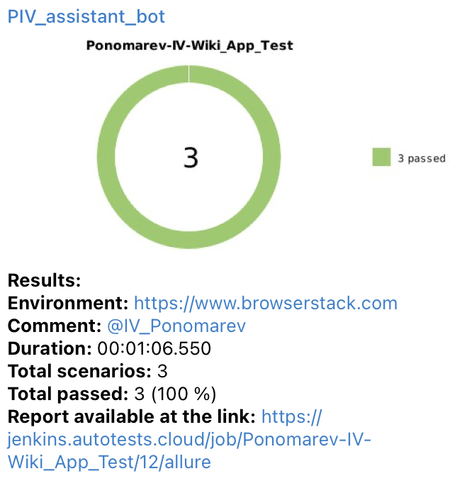

# Демонстрационный проект по тестированию мобильного приложения Wikipedia для Android


## Стек технологий:


## Для запуска тестов локально необходимо:
1. Подготовить компьютер для запуска тестов по <a target="_blank" href="https://autotest.how/appium-setup-for-local-android-tutorial">инструкции</a>
2. Клонировать репозиторий и перейти в него в командной строке:
```
git clone https://github.com/ponomarev-iv1986/wiki_app_test_project.git
```
```
cd wiki_app_test_project
```
3. Создать и активировать виртуальное окружение:
```
python3 -m venv venv
```
- Если у вас Linux/macOS
  ```
  source venv/bin/activate
  ```
- Если у вас Windows
  ```
  source venv/scripts/activate
  ```
4. Обновить pip:
```
pip install --upgrade pip
```
5. Установить зависимости из файла requirements.txt:
```
pip install -r requirements.txt
```
6. Создать и заполнить .env файл, например:
```
touch .env
```
```
echo ENVIRONMENT='local' >> .env
```
```
echo BSTACK_USER='any_browserstack_user_name' >> .env
```
```
echo BSTACK_ACCESS_KEY='any_browserstack_access_key' >> .env
```
7. Запустить тесты:
```
pytest .
```

## Для автоматизированного запуска тестов на сервисе <a target="_blank" href="https://www.browserstack.com">Browserstack</a> написана джоба в <a target="_blank" href="https://jenkins.autotests.cloud/job/Ponomarev-IV-Wiki_App_Test/">Jenkins</a>.

### Для запуска автотестов необходимо:
- Открыть подготовленную <a target="_blank" href="https://jenkins.autotests.cloud/job/Ponomarev-IV-Wiki_App_Test/">джобу</a> в Jenkins
- Нажать "Build Now" в боковом меню


## После прохождения автотестов можно зайти в <a target="_blank" href="https://jenkins.autotests.cloud/job/Ponomarev-IV-Wiki_App_Test/8/allure/#">Allure Report</a> и посмотреть отчет по тестовому прогону.


### Так же есть возможность подробно посмотреть результат прохождения каждого отдельного теста, проанализировать шаги, логи теста, просмотреть скриншоты и видео прохождения теста.


## Полная статистика по тестовым прогонам хранится в <a target="_blank" href="https://allure.autotests.cloud/project/3761/dashboards">Allure TestOps</a>.

### *Главный дашборд Allure TestOps:*


### *Общий список тест-кейсов проекта, автоматически сгенерированных в Allure TestOps:*


### *История запусков тестовых прогонов в Allure TestOps:*


## Тест-кейсы проекта и результаты тестовых прогонов интегрированы с <a target="_blank" href="https://jira.autotests.cloud/browse/HOMEWORK-937">Atlassian Jira</a> и прилинкованы к соответствующей задаче.


## Для мгновенного получения результатов о тестировании настроено автоматическое оповещение через Telegram.



## Ниже на видео представлен пример короткого теста на сервисе <a target="_blank" href="https://www.browserstack.com">Browserstack</a>.

